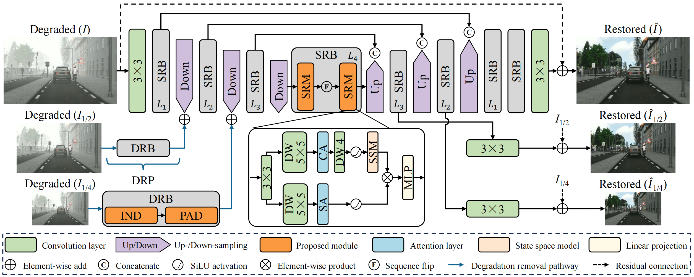

# TDNet (Degradation-aware Comprehensive Task Decomposition for Joint Rain and Haze Removal)
#### News
- **Recent days:** Results of compared methods; Pretrained weights and inference/evaluation codes.
- **Jan 23, 2026:** Initialization of the repository.

> **Simplified abstract:** *This paper has proposed a task decomposition network for joint rain and haze removal in single images, featuring a degradation-aware comprehensive task decomposition (DCTD) based on the distinct properties of weather artifacts. Three subtasks are performed: (1) High-frequency rain removal based on implicit neural deraining module (IND); (2) Low-frequency haze removal through prior adaptive dehazing module (PAD); (3) Weather-degraded background reconstruction via scene restoration module (SRM). Extensive experiments are conducted to demonstrate the efficiency of its designs. Seven benchmarks are included for comparisons or ablations, including RainCityscapes, RainCityscapes-pp, RainhazeSynscapes, Rain200H, RW2AH, SemiSIRR, and REAL-RAIN. PSNR, SSIM, and LPIPS scores are measured for reference-based IQA. For reference-free IQA, we employ NIQE and CLIP-IQA.* 
>

  <figure>
  
  <figcaption>Overall pipeline of the proposed TDNet. DRB and DRP are the acronyms of "Degradation Removal Block" and "Degradation Removal Path"</figcaption>
  </figure>

---

## Installation

More details can be found in the TXT or YAML files from the `envs` folder.

## Results of compared methods and our pretrained models

We will first sort and upload predicted results of compared methods and ours on involved benchmarks. Afterwards, the pretrained weights of our method will be uploaded. Please stay tuned.
<!-- Pretrained weights have been already included in the `checkpoints` folder. Other resouces are all shared in: [百度网盘](https://pan.baidu.com/s/1nV-cI2_-5oghIFqbKCUkdg?pwd=c5fk) or [Google Drive (not ready)](https://pan.baidu.com/s/1nV-cI2_-5oghIFqbKCUkdg?pwd=c5fk) -->

<!-- ## Evaluation

More details can be found in `readme.txt` from the `scripts` folder -->

## Results

  <figure>
  
  <figcaption>Visualizations on the RainhazeSynscapes benchmark (<b>Rain streaks + Rainy haze</b>)</figcaption>
  </figure>

  <figure>
  
  <figcaption>Visualizations on the RainCityscapes-pp benchmark (<b>Rain streaks + Rainy haze + Raindrops</b>)</figcaption>
  </figure>

  <figure>
  
  <figcaption>Visualizations on the RW2AH benchmark (<b>Haze only</b>)</figcaption>
  </figure>

  <figure>
  
  <figcaption>Visualizations on the real-world SemiSIRR benchmark (<b>Rain streaks + Rainy haze</b>)</figcaption>
  </figure>

  <figure>
  
  <figcaption>Instance segmentation based on YOLOv11 on the RainCityscapes-pp benchmark. Odd columns are original inputs, and even columns are restored inputs (<b>Rain streaks + Rainy haze</b>)</figcaption>
  </figure>

## Citation
Our work is built upon the codebase of [SFNet](https://github.com/c-yn/SFNet), [TransMamba](https://github.com/sunshangquan/TransMamba), and [C2PNet](https://github.com/YuZheng9/C2PNet), and we sincerely thank them for their contributions.