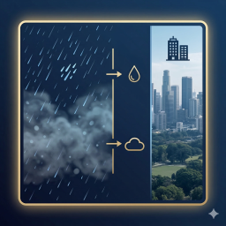
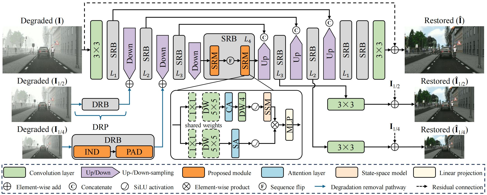
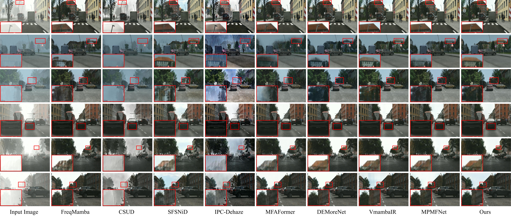
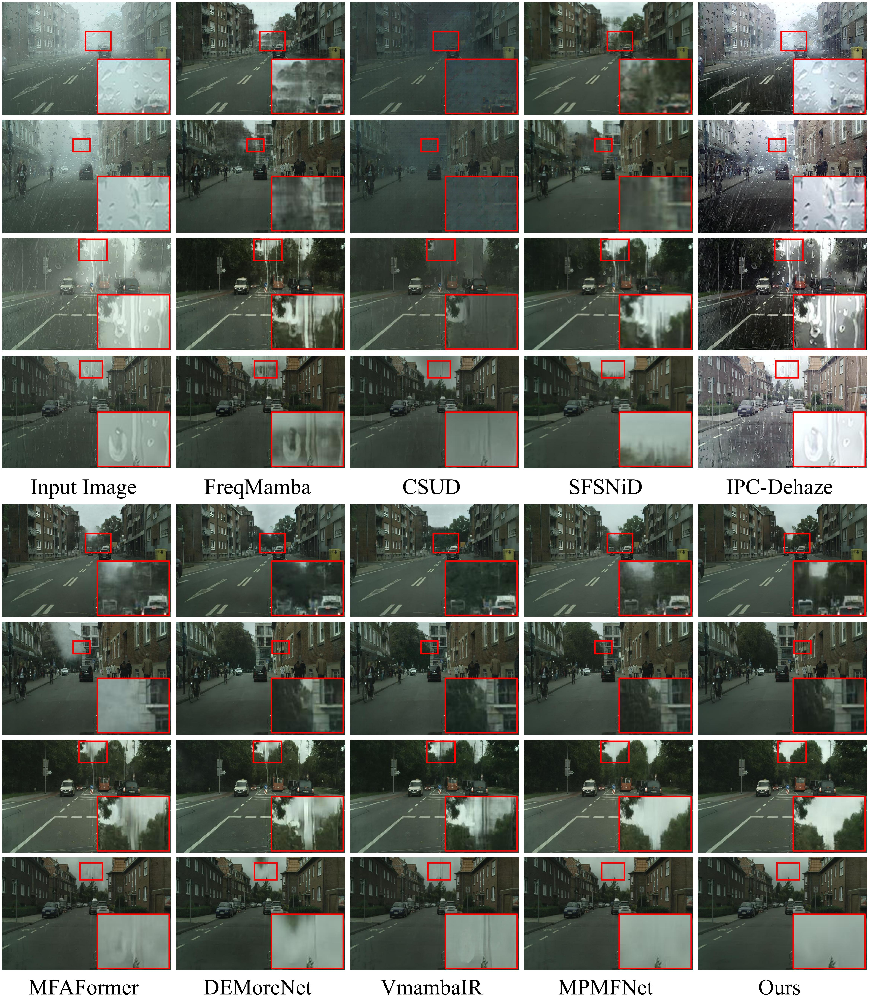
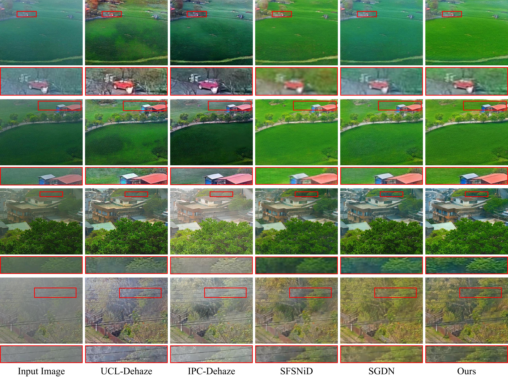
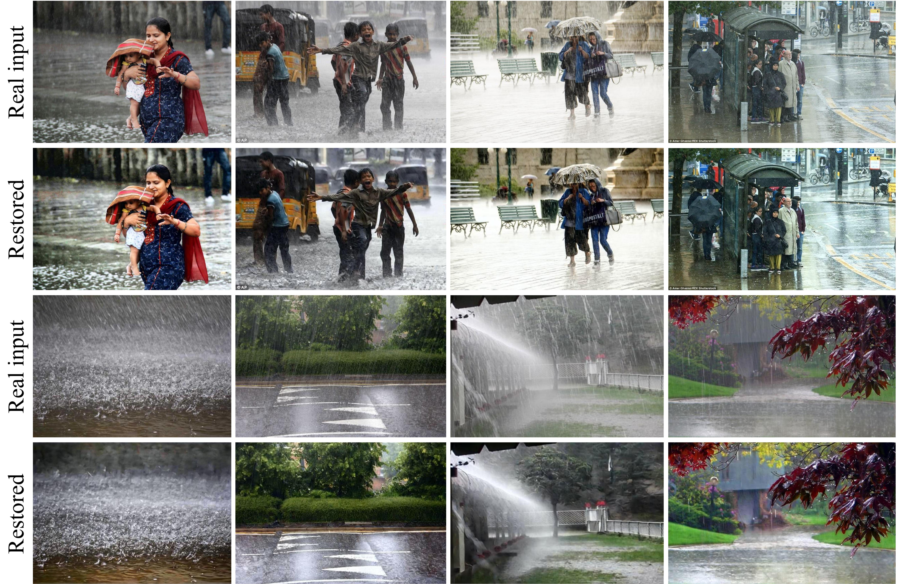
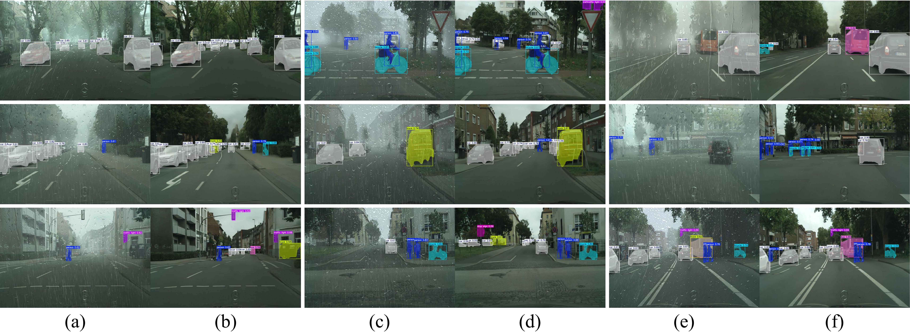

#  TDNet: Degradation-aware Comprehensive Task Decomposition for Joint Rain and Haze Removal

#### Updates
- **Mar 12, 2026:** Results and pretrained weights on five benchmarks are available; Codes for train/test/evaluation are updated.
- **Jan 23, 2026:** Creation of the repository.

<hr />

> **Abstract:** *This repository provides the official implementation of **TDNet**, a physically grounded restoration framework designed to address the coupled nature of joint rain and haze degradations. At the core of our method is the Degradation-aware Comprehensive Task Decomposition (**DCTD**) strategy, which leverages physics-informed inductive biases to both decouple the restoration process into manageable subtasks and guide the architectural design of specialized modules: (1) **IND** (Implicit Neural Deraining): Exploits the inherent low-pass filtering bias of implicit neural representations to naturally isolate and suppress high-frequency rain components. (2) **PAD** (Prior-adaptive Dehazing): Integrates physical scattering priors into the feature space to estimate atmospheric parameters and eliminate the low-frequency global haze effect. (3) **SRM** (Scene Restoration Module): Reconstructs high-fidelity image content from refined intermediate features by capturing long-range dependencies. Extensive experiments are conducted to demonstrate the efficiency of designs. **Seven** benchmarks are included for comparisons or ablations, including <u>RainCityscapes</u>, <u>RainCityscapes-pp</u>, <u>RainhazeSynscapes</u>, <u>Rain200H</u>, <u>RW2AH</u>, <u>SemiSIRR</u>, and <u>REAL-RAIN</u>. PSNR, SSIM, and LPIPS scores are measured for **reference-based** IQA. For **no-reference** IQA, we employ NIQE and CLIP-IQA.*
>

<p align="center">
  <figure>
  
  <figcaption>Overall pipeline of the proposed TDNet. DRB and DRP are the acronyms of "Degradation Removal Block" and "Degradation Removal Path"</figcaption>
  </figure>
</p>

---

## Installation
> More details can be found in the TXT or YAML files from the `envs` folder.

## Our results and pretrained models
> Results on RainhazeSynscapes, Raincityscapes, Raincityscapes-pp, Rain200H, and RW2AH are available at [**<Your-Saved-Images-Path>**](https://pan.baidu.com/s/1mLGH_Zm9lvj11Jn0lZ2keA). Corresponding pretrained weights on these five datasets are available at [**pretrained_ckpt**](https://pan.baidu.com/s/10j1iRyl9HWJS935SvJWSww).

## Train/Test/Evaluation

> More details can be found in the `Derainhaze/run.sh` file.

---

### Training

```bash
# RainCityscapes
python main_multioutput.py --mode train --dataroot <Your-Dataroot-Path> --task_name raincityscape --learning_rate 3e-4 --batch_size 8 --num_epoch 200 --save_freq 4 --valid_freq 4

# RainCityscapes-pp
python main_multioutput.py --mode train --dataroot <Your-Dataroot-Path> --task_name raincityscape_pp --learning_rate 3e-4 --batch_size 8 --num_epoch 200 --save_freq 4 --valid_freq 4

# RainhazeSynscapes
python main_multioutput.py --mode train --dataroot <Your-Dataroot-Path> --task_name rainhaze_synscapes --learning_rate 3e-4 --batch_size 8 --num_epoch 200 --save_freq 4 --valid_freq 4

# RW2AH
python main_multioutput.py --mode train --dataroot <Your-Dataroot-Path> --task_name RW2AH --learning_rate 2e-4 --batch_size 8 --num_epoch 500 --save_freq 4 --valid_freq 4

# Rain200H
python main_multioutput.py --mode train --dataroot <Your-Dataroot-Path> --task_name Rain200H --learning_rate 1e-3 --batch_size 8 --patch_size 128 --num_epoch 500 --save_freq 4 --valid_freq 4
```

---

### Testing

```bash
# RainCityscapes
python main_multioutput.py --mode test --dataroot <Your-Dataroot-Path> --task_name raincityscape --test_model <Your-Pretrained-CKPT-Path>/raincityscape/Best.pkl --save_image True

# RainCityscapes-pp
python main_multioutput.py --mode test --dataroot <Your-Dataroot-Path> --task_name raincityscape_pp --test_model <Your-Pretrained-CKPT-Path>/raincityscape_pp/Best.pkl --save_image True

# RainhazeSynscapes
python main_multioutput.py --mode test --dataroot <Your-Dataroot-Path> --task_name rainhaze_synscapes --test_model <Your-Pretrained-CKPT-Path>/rainhaze_synscapes/Best.pkl --save_image True

# RW2AH
python main_multioutput.py --mode test --dataroot <Your-Dataroot-Path> --task_name RW2AH --test_model <Your-Pretrained-CKPT-Path>/RW2AH/Best.pkl --save_image True

# Rain200H
python main_multioutput.py --mode test --dataroot <Your-Dataroot-Path> --task_name Rain200H --test_model <Your-Pretrained-CKPT-Path>/Rain200H/Best.pkl --save_image True
```

---

### Evaluation

#### Reference-based Metrics

```bash
python calculate_metrics_basicsr.py --dataset rainhaze_synscapes
python calculate_metrics_basicsr.py --dataset raincityscape
python calculate_metrics_basicsr.py --dataset raincityscape_pp
python calculate_metrics_basicsr.py --dataset Rain200H
python calculate_metrics_basicsr.py --dataset RW2AH
```

#### No-reference Metrics

```bash
python calculate_metrics_rf.py clipiqa <Your-Saved-Images-Path>/Rain200H
python calculate_metrics_rf.py niqe <Your-Saved-Images-Path>/Rain200H
python calculate_metrics_rf.py clipiqa <Your-Saved-Images-Path>/RW2AH
python calculate_metrics_rf.py niqe <Your-Saved-Images-Path>/RW2AH
```

---

### Additional Tools

- **FPS Test**
  ```bash
  python test_fps.py
  ```

- **Params & FLOPs**
  ```bash
  python test_complexity.py
  ```

## Visualization

<p align="center">
  <figure>
  
  <figcaption>Visualizations on the RainhazeSynscapes benchmark (<b>Rain streaks + Rainy haze</b>)</figcaption>
  </figure>
</p>

<p align="center">
  <figure>
  
  <figcaption>Visualizations on the RainCityscapes-pp benchmark (<b>Rain streaks + Rainy haze + Raindrops</b>)</figcaption>
  </figure>
</p>

<!-- <p align="center">
  <figure>
  
  <figcaption>Visualizations on the Rain200H benchmark (<b>Rain only</b>)</figcaption>
  </figure>
</p>

<p align="center">
  <figure>
  
  <figcaption>Visualizations on the RW2AH benchmark (<b>Haze only</b>)</figcaption>
  </figure>
</p> -->

<p align="center">
  <figure>
  
  <figcaption>Visualizations on the real-world SemiSIRR benchmark (<b>Rain streaks + Rainy haze</b>)</figcaption>
  </figure>
</p>

<p align="center">
  <figure>
  
  <figcaption>Instance segmentation based on YOLOv11 on the RainCityscapes-pp benchmark. Odd columns are original inputs, and even columns are restored inputs (<b>Rain streaks + Rainy haze + Raindrops</b>)</figcaption>
  </figure>
</p>

## Acknowledgements
Our work is built upon the codebase of [SFNet](https://github.com/c-yn/SFNet), [TransMamba](https://github.com/sunshangquan/TransMamba), [Restormer](https://github.com/swz30/Restormer), and [C2PNet](https://github.com/YuZheng9/C2PNet), and we sincerely thank them for their contributions.